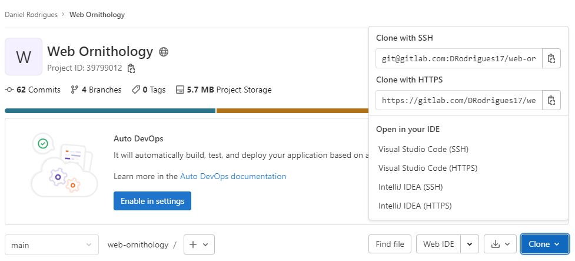
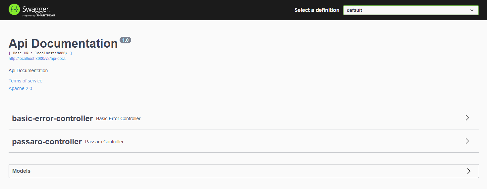

O Web-Ornithology é uma aplicação criada em Angluar.js e SpringBoot durante o StartDb

acesse a wiki para saber mais sobre a estrutura, recursos e fontes de pesquisa:
>https://gitlab.com/DRodrigues17/web-ornithology/-/wikis/Home

# Atenção

Caso você pretenda rodar essa aplicação na sua maquina, você precisara das sequintes coisas:
- Um jdk, recomendamos o 17 por ser o mais estável atualmente;
- Uma IDE que compile código java, recomendamos o Intellij, pois com ele você pode até instalar o jdk se não tiver instalado;
- postgresql ou docker caso não queira instalar um banco de dados;
- node;
- angular instalado;

Tendo os requerimentos acima, você terá que clonar o projeto, perceba que na página tem um botão azul escrito clone, clique nele e verá diversas opções de clonagem, escolha a que preferir (é esperado que para seguir esse tutorial você tenha o conhecimento básico de git).

Para para que o front end do projeto seja executável, será necessário o seguinte comando na pasta frontend
> npm install @angular/cli 

# Como Rodar o projeto

**Caso for usar o docker,**
antes de rodar a aplicação vá na pasta backend\src\main\resources, 
abra um terminal e rode o seguinte comando:
> docker-compose up --build

isso irá habilitar o banco de dados. 

Após isso rode a aplicação normalmente na sua IDE de preferencia e acesse via browser a seguinte url:
> http://localhost:8080/swagger-ui/index.html

Com isso você verá a seguinte inferface com os métodos da API

Agora, se você quiser acessar a aplicação via browser com o frontend em agular, vá ao terminal e rode o seguinte comando
>ng serve -o --poll=2000

Nisso você vai no browser (caso ele não tenha sido aberto automaticamente) e acessa a seguinte url:
> http://localhost:4200/
